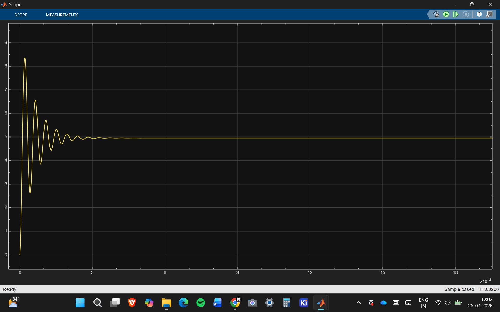
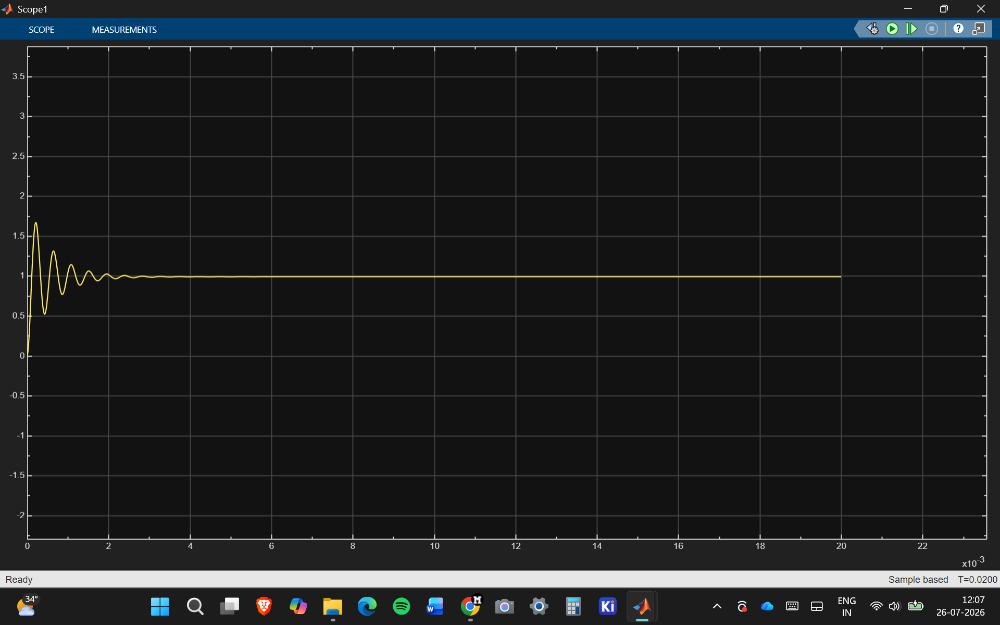

# STM32 Controlled Synchronous Buck Converter

MATLAB and Simulink model of a 12 V to 5 V synchronous buck converter. I used an averaged model and a PWM switching model to check the power stage at the same operating point. The digital control target is an STM32G431RB.

## Design values

| Parameter | Value |
|---|---:|
| Input | 10 to 14 V |
| Nominal input | 12 V |
| Output | 5 V |
| Maximum current | 2 A |
| Switching frequency | 100 kHz |
| Inductor | 47 uH |
| Output capacitor | 100 uF |
| Nominal duty cycle | 41.67% |

At 12 V input with a 5 ohm load, both models settle close to 5 V and 1 A. The startup ringing is from the LC output filter.

## Simulation results

### Averaged model

### PWM switching model

## Running the models

1. Run `MATLAB/buck_parameters.m`.
2. Open either model from the `Simulink` folder.
3. Run the simulation and open the voltage and current scopes.

The models were made in MATLAB R2025b using Simulink and Simscape Electrical.

## Repository files

- `MATLAB/buck_parameters.m`: design calculations and workspace values
- `Simulink/buck_average_open_loop.slx`: averaged converter model
- `Simulink/buck_switching_open_loop.slx`: PWM switching model
- `Documentation`: specifications and test notes
- `Results`: calculated values and output waveforms

## Keywords

Power electronics, synchronous buck converter, DC-DC converter, MATLAB, Simulink, Simscape Electrical, PWM, LC filter, STM32G4, voltage regulation.

