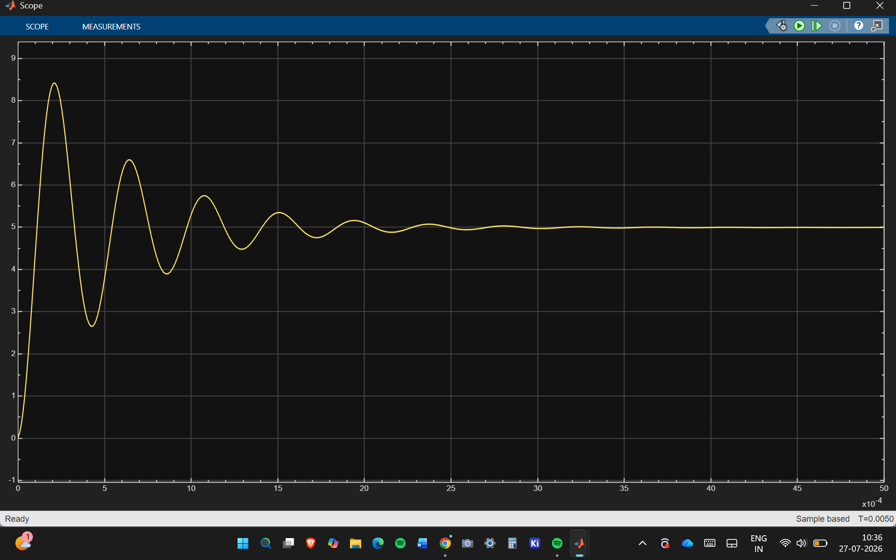
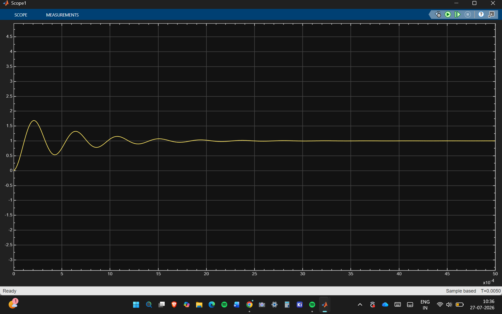

# Phase 2 Open-Loop Validation

## Test conditions

| Parameter | Value |
|---|---:|
| Input voltage | 12 V |
| PWM switching frequency | 100 kHz |
| Ideal duty cycle | 41.67% |
| Load resistance | 5 Ω |
| Expected output voltage | 5 V |
| Expected load current | 1 A |
| Averaged-model stop time | 20 ms |
| Switching-model stop time | 5 ms |

## Averaged model

The averaged Simscape model settles close to the expected operating point:

- Output voltage: approximately 5 V
- Load current: approximately 1 A
- Startup behavior: decaying LC oscillation
- Final behavior: stable

## PWM-switching model

The switching Simscape model uses complementary high-side and low-side PWM commands. It also settles close to the expected operating point:

- Output voltage: approximately 5 V
- Load current: approximately 1 A
- Startup behavior: decaying LC oscillation
- Final behavior: stable

## Validation conclusion

The averaged and switching models agree at the nominal steady-state operating point. This provides the validated power-stage foundation for Phase 3 closed-loop PI controller design.

The present current sensor measures output/load current rather than internal inductor current. Inductor-current ripple and PWM dead time will be documented separately.
